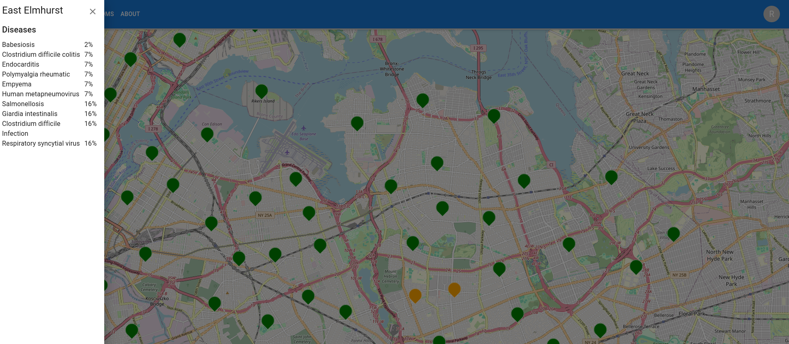
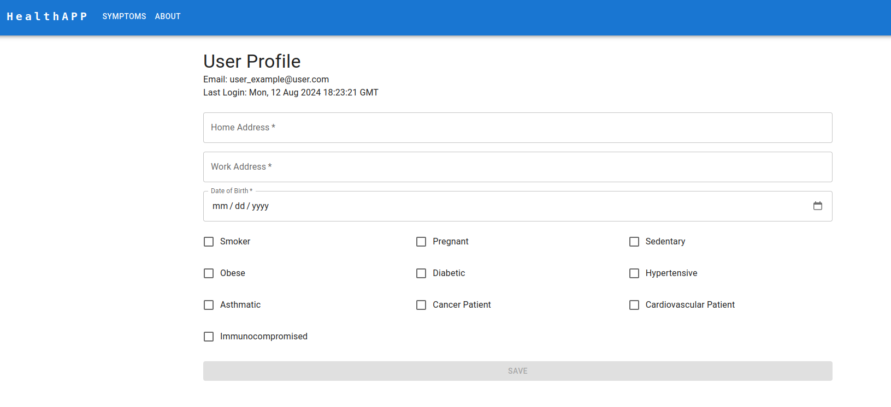
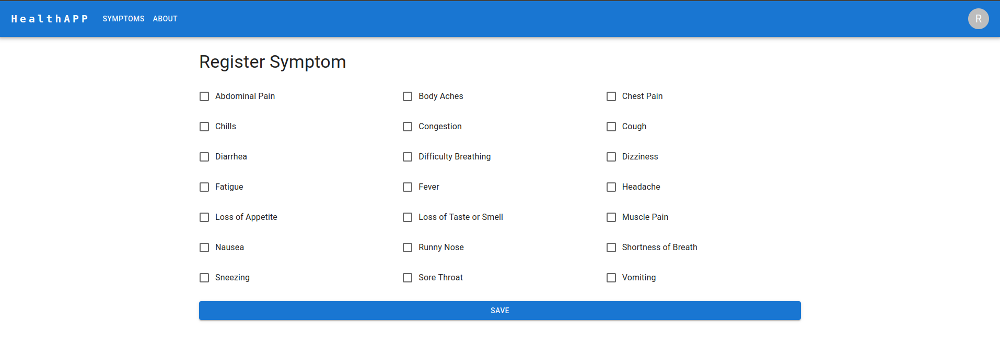
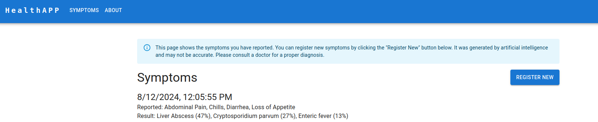

## Overview

The model aims to estimate the probability of various diseases for a user based on their symptoms, the distribution of diseases in different neighborhoods, and the presence of specific risk factors. This estimation is particularly useful in public health scenarios for timely interventions and resource allocation.

Each neighborhood have an associated distribution of reported diseases:

The user can add their risk factors:

The user can select symptoms: 

And the model leverages generative AI to calculate the probabilities of diseases
based on the symptons, the user's risk factors and the disease distribution around the
user's neighborhood.

## INSTRUCTIONS

Instructions to run the application can be found in functions/README.md and 
frontend/README.md.

# Disease Probability Estimation Model

## Components of the Model

### Symptom-Based Probability ($P_{\text{symptom}}$)

This represents the initial probability of each disease based on the symptoms displayed by the user. For example:

$$P_{\text{symptom}} = \{\text{DiseaseA}: 0.3, \text{DiseaseB}: 0.5, \text{DiseaseC}: 0.2\}$$

### Neighborhood Disease Distribution ($P_{\text{all-neighborhoods}}$)

This dictionary contains the probability distribution of diseases across all neighborhoods. Each entry includes the date, probability, neighborhood name, and disease name. An example entry might look like:

$$P_{\text{all-neighborhoods}} = \{\text{id1}: \{\text{date}: \text{'2024-01-22'}, \text{probability}: 0.71, \text{neighborhood}: \text{'NeighborhoodA'}, \text{disease}: \text{'DiseaseA'}\}, \ldots \}$$

### Distances Between Neighborhoods (distances)

This dictionary holds the distances between the user's neighborhood and other neighborhoods. For example:

$$\text{distances} = \{\text{UserNeighborhood}: \{\text{NeighborhoodA}: 2.0, \text{NeighborhoodB}: 5.0, \ldots\}\}$$

### Risk Factors ($R_{\text{user}}$)

The model also considers various risk factors that could increase the probability of specific diseases. These risk factors include:

- is_asthmatic
- is_cancer_patient
- is_cardiovascular_patient
- is_diabetic
- is_hypertensive
- is_immunocompromised
- is_obese
- is_over_65_years_of_age
- is_pregnant
- is_sedentary
- is_smoker

The impact of these risk factors is quantified by augmenting the probability of a disease by a factor of $1.1^{n}$, where $n$ is the number of risk factors associated with the disease that the user has.

## Calculation of Combined Probabilities

The combined probability for each disease in the user's neighborhood is calculated using a weighted sum approach, combining both the symptom-based probability and the neighborhood-based probabilities, with adjustments for the user's risk factors.

### Weighted Sum Calculation

For each disease, we calculate a weighted sum of probabilities from the neighborhood distribution, inversely weighted by the distance to the user's neighborhood. Closer neighborhoods have a higher influence on the result.

### Incorporating User's Neighborhood Data

The probability of diseases in the user's own neighborhood is directly included with a predefined weight ($\alpha$). This ensures that local data is given significant consideration.

### Adjustment for Risk Factors

The initial symptom-based probability is adjusted by the risk factors associated with the disease. If the user has $n$ risk factors associated with a disease, the probability for that disease is multiplied by $1.1^{n}$.

### Normalization

After calculating the combined probabilities, we normalize them to ensure they sum up to 1, making them valid probabilities.

## Mathematical Representation

The combined probability for a disease in the user's neighborhood is given by:

$$
P_{\text{combined}}(\text{disease}) = \left(P_{\text{symptom}}(\text{disease}) \times 1.1^{n} \right) \times \left( \alpha \times P_{\text{user-neighborhood}}(\text{disease}) + \beta \times \left( \sum_{i=1}^{n} \frac{P_{\text{other-neighborhoods}}(\text{disease}, i)}{D(i)} \right) \right)
$$

Where:

- $$P_{\text{combined}}(\text{disease})$$ is the combined probability for a disease in the user's neighborhood.
- $$P_{\text{symptom}}(\text{disease})$$ is the symptom-based probability for the disease.
- $n$ is the number of risk factors associated with the disease that the user has.
- $$P_{\text{user-neighborhood}}(\text{disease})$$ is the probability of the disease in the user's own neighborhood.
- $$P_{\text{other-neighborhoods}}(\text{disease}, i)$$ is the probability of the disease in the $i$-th other neighborhood.
- $$D(i)$$ is the distance between the user's neighborhood and the $i$-th other neighborhood.
- $\alpha$ and $\beta$ are weighting factors for the user's own neighborhood data and other neighborhoods data, respectively.

## Integration of Retrieval-Augmented Generation (RAG)

To enhance the accuracy of disease probability estimation, the model leverages Retrieval-Augmented Generation (RAG). This approach is particularly effective in sourcing relevant medical information from a vast repository of medical PDFs.

### Symptom-to-Disease Mapping Using RAG

For each symptom reported by the user, the model performs a RAG search across medical PDFs to retrieve the diseases associated with that symptom. This process allows the model to dynamically pull in the most relevant and up-to-date medical information, ensuring that the disease probabilities are based on authoritative sources.

### Defining Disease Probabilities

Once the diseases associated with the user's symptoms are retrieved, the model defines the probability of each disease based on its relative frequency in the list of all diseases retrieved for the given symptoms. Specifically, the probability of a disease is calculated as the relative frequency of its appearance in the combined list of diseases associated with the user's symptoms.

### Risk Factors Identification Using RAG

In addition to symptom-to-disease mapping, the model also uses RAG to identify the risk factors associated with each disease. By searching medical PDFs, the model retrieves relevant risk factors for each disease, ensuring that the probability calculations account for the specific conditions that may exacerbate the likelihood of developing the disease.

### Incorporating Risk Factors into Disease Probabilities

After identifying the relevant risk factors through RAG, the model adjusts the disease probabilities accordingly. If a user has certain risk factors that are associated with a specific disease, the model increases the probability of that disease using a predefined adjustment factor. This ensures that the model accounts for individual user conditions in its predictions.

### Example

Suppose the user reports symptoms A, B, and C, and also has risk factors X, Y, and Z. The model retrieves a list of diseases and associated risk factors using RAG:

- Symptom A: Disease 1, Disease 2, Disease 3
- Symptom B: Disease 2, Disease 3, Disease 4
- Symptom C: Disease 1, Disease 3, Disease 5

Risk factors identified through RAG:

- Disease 1: Associated with risk factors X and Y
- Disease 2: Associated with risk factor Z
- Disease 3: Associated with risk factors X, Y, and Z

The probabilities are then adjusted based on the presence of these risk factors, enhancing the model's ability to predict diseases based on both symptoms and individual risk profiles.

### Importance of RAG

By using RAG for both symptom-to-disease mapping and risk factor identification, the model ensures that its disease probability estimates are grounded in the latest medical knowledge. This method enhances the model's ability to provide accurate and reliable predictions, which is crucial for effective public health interventions.

## Technologies Used

The project leverages a range of advanced technologies to ensure efficient data processing, storage, and retrieval, as well as accurate disease probability estimation.

### Google Firebase

Google Firebase serves as the backend infrastructure for the project. It provides the necessary tools and services to build and manage the application's backend, including real-time databases, authentication, and hosting.

### Google Firebase Authentication

Google Firebase Authentication is a service by Firebase that provides secure authentication solutions, enabling web and mobile apps to manage user sign-ups, sign-ins, and access control. We use this tool to authenticate users with email and password.

### Google Firestore

Google Firestore is used as the primary database for storing and retrieving data related to symptoms, diseases, neighborhoods, and risk factors. Its real-time capabilities allow for quick and efficient data retrieval, which is crucial for timely analysis and decision-making.

### Google Firebase Function

Google Firebase Cloud Functions is a serverless, event-driven execution environment allowing developers to run backend code directly in response to events triggered by Firebase features or external sources.

### Google Firebase Hosting

Google Firebase Hosting is a fast, secure, and scalable cloud hosting solution for web applications, providing easy deployment, global content delivery, and custom domain support. We use firebase hosting to host the web page of the solution that was developed using React and Typescript.

### Google Geocoding API

The Google Geocoding API is utilized to convert neighborhood addresses into geographic coordinates. This allows the model to calculate distances between neighborhoods accurately, which is a key component in the weighted sum calculation for disease probabilities.

### Gemini 1.5 Pro

Gemini 1.5 Pro is employed as the language model for natural language processing tasks within the project. It powers the Retrieval-Augmented Generation (RAG) processes, enabling the model to pull relevant information from a vast collection of medical PDFs.

### LangChain

LangChain is used to manage the interaction between the language model and the various data sources. It facilitates the orchestration of RAG processes, ensuring that the right context is provided to the language model for accurate information retrieval.

### VertexAIEmbeddings

VertexAIEmbeddings are used to create vector representations of symptoms, diseases, and risk factors. These embeddings enhance the model's ability to perform similarity searches and retrieve the most relevant information during the RAG process.

---

These technologies work together to create a robust and efficient system for disease probability estimation, leveraging the power of modern cloud infrastructure, machine learning, and natural language processing.
